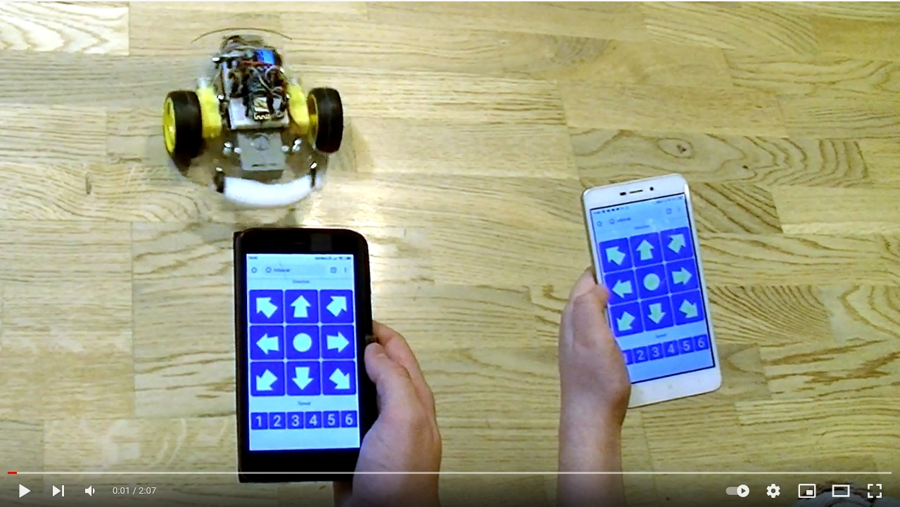

# WEB-controlled robocar @ ESP8266

## Install
1. Flash one of binary file from **nodemcu** folder into ESP8266 
2. Edit **web\init.lua** and set SSID & PASSWORD values of your wi-fi router (station_cfg.ssid and station_cfg.pwd)
3. Upload all files from **web** folder into nodemcu file system
4. Connect perifery (motor driver and I2C OLED display) to ESP8266 module, see pins in web\init.lua file.
